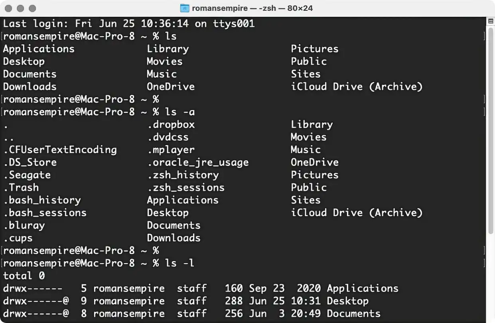

iTerm2設定教學
============
原生的MacOS系統的終端機是黑白的顏色  

原生的字體是黑底白字，在找自己剛剛打了什麼東西的時候總是非常困難，但是iTerm2有許多客製化的介面，可以讓你的終端機看起來很潮，多種顏色讓你的<del>人生</del> 終端機不再黑白  

安裝iTerm2搭配oh my zsh之後的終端機樣式


iTerm2安裝
--------
#### 透過Homebrew安裝  
Homebrew是一種Mac的免費開源套件管理工具  
在terminal輸入以下指令可以安裝Homebrew  
```
$ /bin/bash -c "$(curl -fsSL https://raw.githubusercontent.com/Homebrew/install/HEAD/install.sh)"
```


